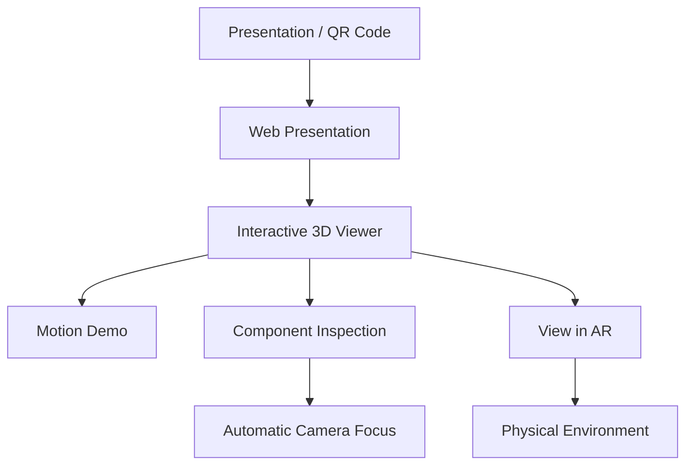
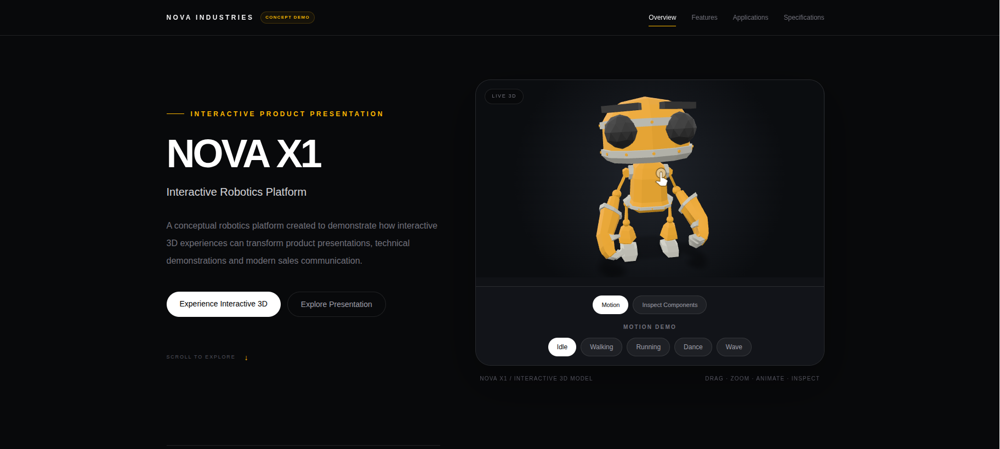
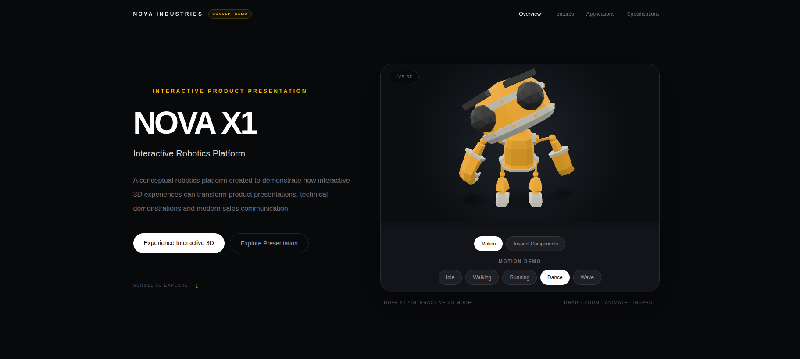
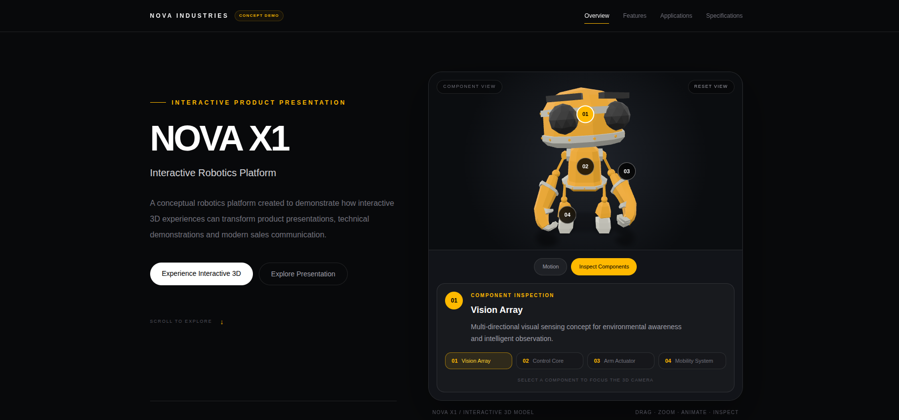
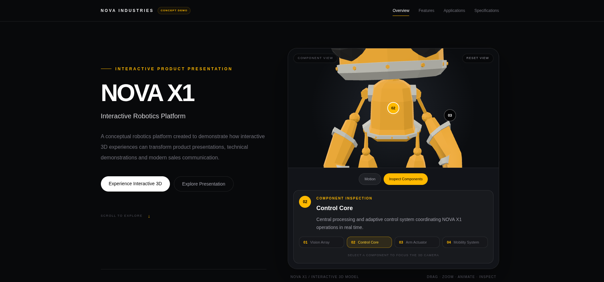
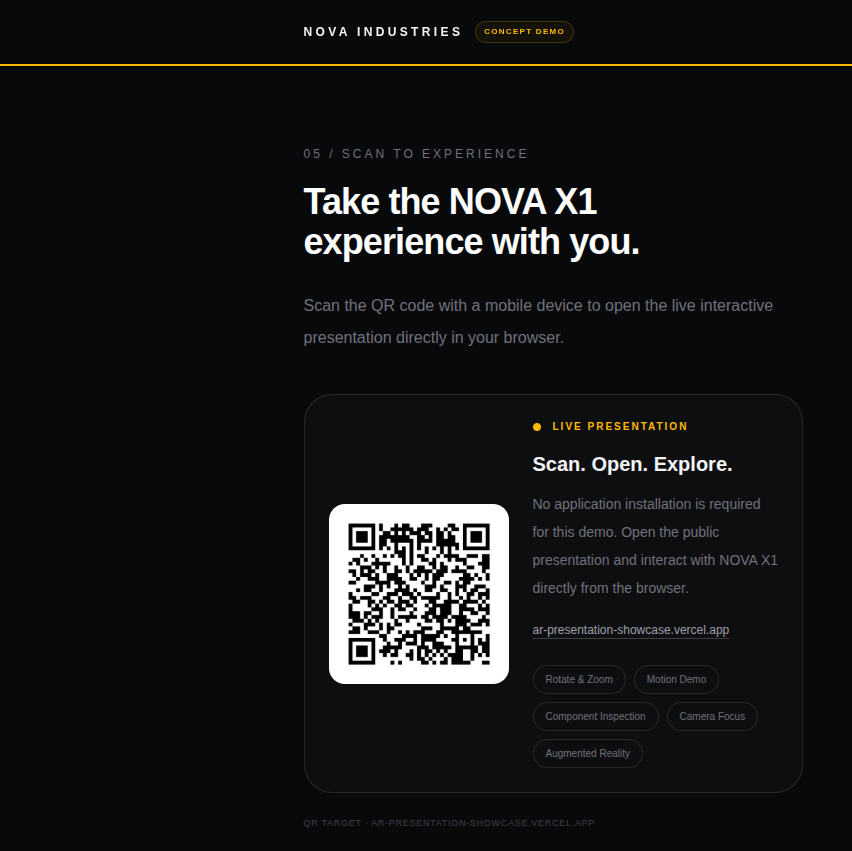
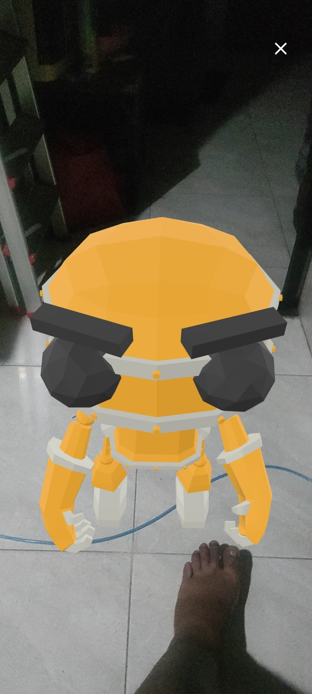
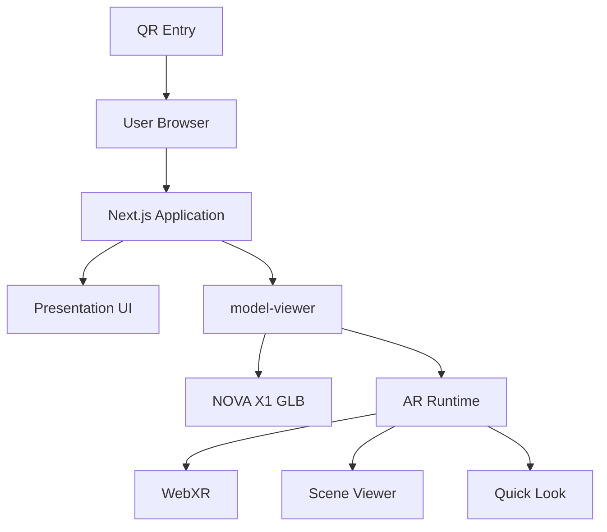

# AR Presentation Showcase

**Interactive 3D & Augmented Reality Product Presentation — Portfolio Concept Demo**

[](https://ar-presentation-showcase.vercel.app)
[](https://nextjs.org/)
[](https://modelviewer.dev/)

## Live Demo

**https://ar-presentation-showcase.vercel.app**

For the full experience, open the demo on a compatible mobile device and try **View in AR**.

## Overview

AR Presentation Showcase is a portfolio proof-of-concept showing how a conventional product presentation can become an interactive web experience using 3D visualization and augmented reality.

The fictional product **NOVA X1** can be rotated and zoomed, animated through multiple motion sequences, inspected through interactive hotspots, automatically focused by the 3D camera, opened from a QR code, and placed into a physical environment using AR.

> **NOVA Industries and NOVA X1 are fictional concept assets created solely for this portfolio demonstration.**

## Problem / Use Case

Traditional product presentations commonly rely on static images, brochures, slide decks, specification tables, and video. Those formats can explain a product, but they do not let the audience directly explore it.

```text
Presentation
    ↓
Interactive 3D
    ↓
Animation
    ↓
Component Inspection
    ↓
Camera Focus
    ↓
QR Access
    ↓
Augmented Reality
```

## Key Features

### Interactive 3D Viewer
- Drag to rotate
- Scroll or pinch to zoom
- Responsive desktop and mobile interaction

### Motion Demonstration
- Idle
- Walking
- Running
- Dance
- Wave

### Component Inspection
1. **Vision Array**
2. **Control Core**
3. **Arm Actuator**
4. **Mobility System**

### Automatic Camera Focus
Selecting a component automatically adjusts the camera to focus on that area. A **Reset View** control restores the full-body view.

### Augmented Reality
On supported mobile devices, **View in AR** places NOVA X1 into the user's physical environment using `model-viewer` AR capabilities.

### QR Presentation Access
Generated QR assets:

```text
public/qr/nova-x1-presentation.png
public/qr/nova-x1-presentation.svg
```

QR target:

```text
https://ar-presentation-showcase.vercel.app
```

## Experience Flow



## Screenshots

### Hero Presentation



### Interactive 3D Features

| Motion Demo | Component Inspection |
|---|---|
|  |  |

| Automatic Camera Focus | QR Experience |
|---|---|
|  |  |

### Augmented Reality — Real Device Test

The augmented-reality flow was validated on a physical mobile device by placing NOVA X1 into a real environment.

<p align="center">
  
</p>

---

## Technology Stack

| Layer | Technology |
|---|---|
| Framework | Next.js 16.3.1 |
| UI | React 19.2.8 |
| Language | TypeScript |
| Styling | Tailwind CSS |
| 3D / AR | `@google/model-viewer` 4.3.1 |
| 3D Dependency | Three.js 0.183.2 |
| Model Format | GLB / glTF |
| QR Generation | `qrcode` |
| Deployment | Vercel |
| Source Control | Git / GitHub |

## Architecture



No database, authentication, payment gateway, or backend is required for this concept demo.

## Project Structure

```text
ar-presentation-showcase/
├── app/
│   ├── icon.tsx
│   ├── layout.tsx
│   ├── opengraph-image.tsx
│   ├── page.tsx
│   ├── robots.ts
│   ├── sitemap.ts
│   └── twitter-image.tsx
├── components/
│   └── model-viewer.tsx
├── public/
│   ├── models/
│   │   └── nova-x1.glb
│   └── qr/
│       ├── nova-x1-presentation.png
│       └── nova-x1-presentation.svg
├── scripts/
│   └── generate-qr.mjs
├── docs/
│   └── screenshots/
├── package.json
└── README.md
```

## Local Development

Requirements:

```text
Node.js 24+
npm 11+
```

Clone and install:

```bash
git clone https://github.com/loctate/ar-presentation-showcase.git
cd ar-presentation-showcase
npm ci
```

Run:

```bash
npm run dev
```

## Validation

```bash
npm run lint
npm run typecheck
npm run build
```

The typecheck workflow runs:

```text
next typegen && tsc --noEmit
```

Recommended clean validation:

```bash
npm ci
npm run lint
npm run typecheck
npm run build
```

## QR Generation

```bash
npm run qr:generate
```

Custom target:

```bash
QR_URL="https://example.com" npm run qr:generate
```

## Deployment

Production:

**https://ar-presentation-showcase.vercel.app**

Deployment flow:

```text
Local Development
        ↓
Validation
        ↓
Git Commit
        ↓
Push to main
        ↓
GitHub
        ↓
Vercel Build
        ↓
Production
```

## AR Compatibility

The standard 3D presentation works in modern browsers with WebGL support.

**View in AR** additionally depends on device and browser capabilities such as AR services, WebXR, Scene Viewer, Quick Look, and camera permissions.

## Scope

### Included
- Responsive presentation
- Interactive GLB viewer
- Motion animations
- Component hotspots
- Automated camera focus
- Reset view
- QR access
- Production deployment
- Augmented reality
- Metadata and social-sharing assets

### Not Included
- Authentication
- Database
- Admin dashboard
- Ecommerce
- Checkout
- Payment processing
- Multi-product catalogue
- Analytics platform
- CMS
- AI product generation

## Potential Commercial Applications

- Industrial product presentations
- Furniture visualization
- Property presentations
- Exhibition booths
- Interactive catalogues
- Machinery demonstrations
- Technical training
- Sales presentations
- Digital company profiles
- Product launches
- AR commerce experiences

## Limitations

This is a controlled concept demonstration, not a production commercial platform.

Current limitations include one demonstration product, fictional specifications, no persistent backend, no product-management interface, device-dependent AR behaviour, and hotspot calibration specific to the current model.

## 3D Asset Credit

The NOVA X1 demonstration uses the **RobotExpressive** GLB model from the Three.js / model-viewer example ecosystem.

Upstream references:
- https://github.com/mrdoob/three.js
- https://github.com/google/model-viewer

The NOVA X1 identity, fictional specifications, component descriptions, presentation design, interaction flow, and implementation were created for this portfolio project.

## Project Status

**Completed — Portfolio / Concept Demo**

- [x] Responsive presentation
- [x] Interactive 3D model
- [x] Rotate and zoom
- [x] Motion animations
- [x] Component hotspots
- [x] Automatic camera focus
- [x] Reset view
- [x] QR access
- [x] Production deployment
- [x] GitHub → Vercel automatic deployment
- [x] Mobile testing
- [x] Augmented reality placement
- [x] Metadata and SEO
- [x] Social-sharing assets

Portfolio documentation and final visual capture are complete. The project is now in the final QA and release-lock stage.

## Disclaimer

**NOVA Industries is not a real client or company represented by this project.**

NOVA Industries and NOVA X1 are fictional concept identities used solely to demonstrate interactive 3D and augmented reality presentation technology.

No commercial performance, conversion improvement, operational capability, or product specification shown in this demo should be interpreted as a claim about a real product.

## Author

**Bonar Sulaiman**

GitHub: [@loctate](https://github.com/loctate)

## Next Exploration

The technology validated here can be extended into a separate **Product AR / AR Commerce** project where real products can be browsed, previewed in 3D, placed in physical spaces, and integrated into a commercial catalogue.